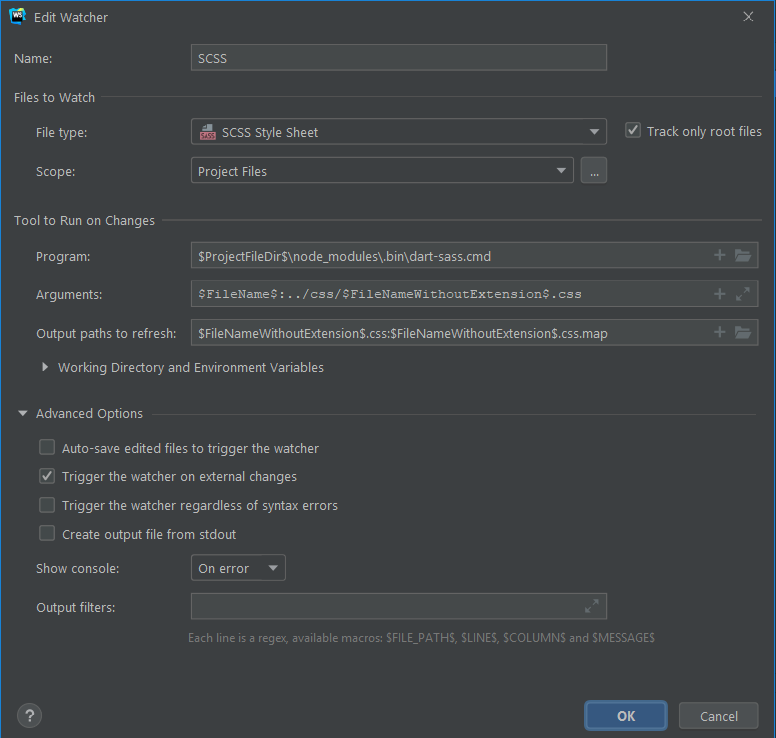

# UI Dev

Just a quick repo I made to test UI development

# Usage

The server will watch HTML/CSS/JS and reload when changes are detected.

`npm run server`

If you need anything else to work with (e.g. `bulma` or `nord`) simply install them with npm.

# Jetbrains FileWatcher (if available)

This image was taken on Windows,
so `Program` may need to be changed on *nix.

